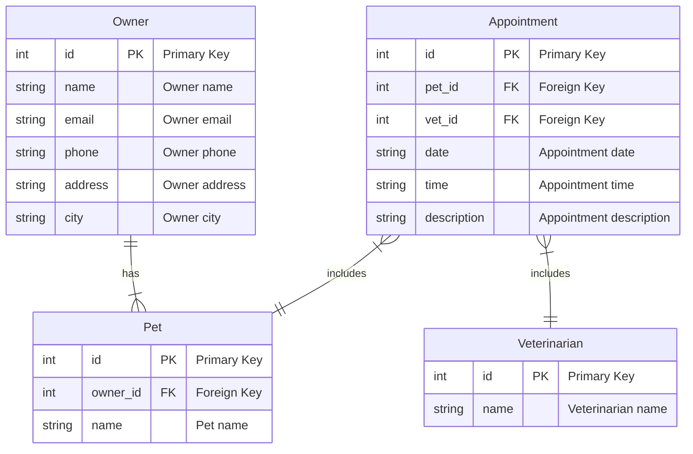
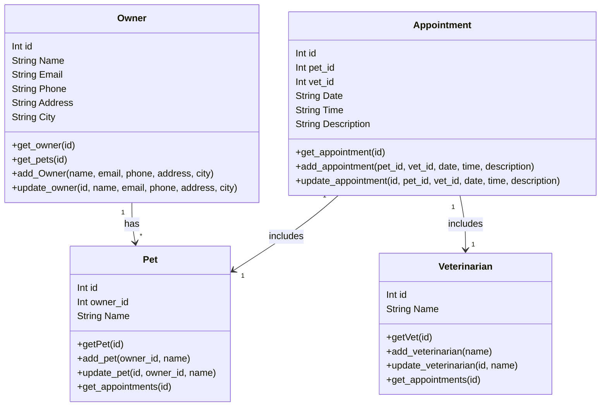

# API Agenda

Api de agendamento veterinário





## Tech Stack

### Development

- [Git](https://git-scm.com/)
- [Poetry](https://python-poetry.org/)

### Backend

- [FastAPI](https://fastapi.tiangolo.com/)

## Run Locally

Clone the project

```bash
git clone https://github.com/RCristiano/agente-agenda
```

Go to the project directory

```bash
cd agente-agenda
```

Install dependencies

```bash
poetry install
```

Start the server

```bash
poetry run uvicorn main:app --reload
```

### Live server

Open your browser at http://127.0.0.1:8000.

### Interactive API docs

Go to http://127.0.0.1:8000/docs.

### Alternative API docs

And now, go to http://127.0.0.1:8000/redoc.

## Authors

- Alexandre Junio dos Santos Vieira, RA 2010464
- Fábio Borges Dias, RA 2007056
- [Fabio Rogerio Lins Pereira, RA 2003660](https://github.com/frlps)
- Gustavo Guerreiro Martinho da Cunha Sales, RA 2001642
- Marcio M. Marcelli, RA 2002829
- [Rodrigo Cristiano Ferreira Vieira, RA 2015474](https://www.github.com/RCristiano)
