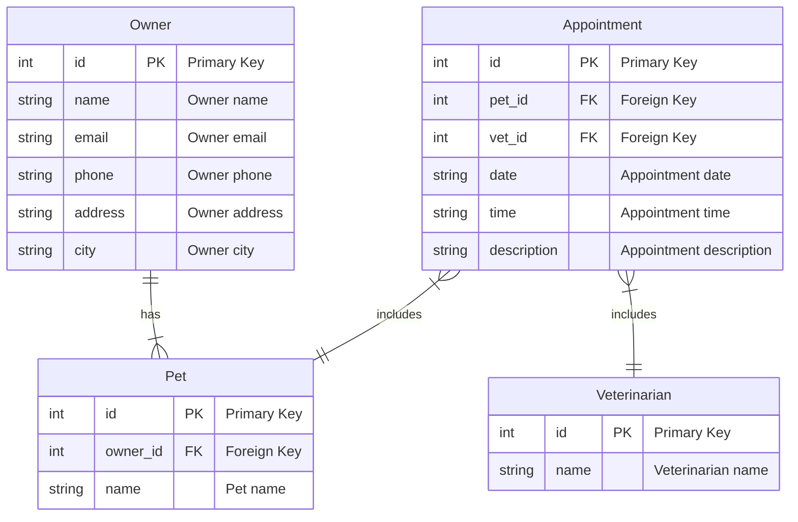

# API Agenda

Api de agendamento veterinário

```mermaid
erDiagram
    Owner {
        int id PK "Primary Key"
        string name "Owner name"
        string email "Owner email"
        string phone "Owner phone"
        string address "Owner address"
        string city "Owner city"
    }
    Pet {
        int id PK "Primary Key"
        int owner_id FK "Foreign Key"
        string name "Pet name"
    }
    Veterinarian {
    int id PK "Primary Key"
        string name "Veterinarian name"
    }
    Appointment {
        int id PK "Primary Key"
        int pet_id FK "Foreign Key"
        int vet_id FK "Foreign Key"
        string date "Appointment date"
        string time "Appointment time"
        string description "Appointment description"
    }
    Owner ||--|{ Pet : has
    Appointment }|--|| Pet : includes
    Appointment }|--|| Veterinarian : includes
```
